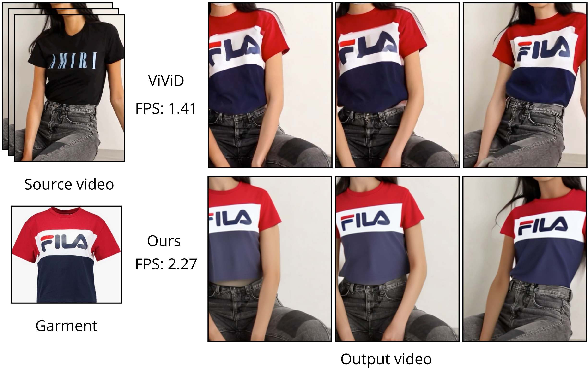

- [Abstract](#abstract)
- [✨ Citation](#-citation)
- [Project structure](#project-structure)
- [Installation](#installation)
- [Running](#running)
  - [Inference](#inference)
  - [Evaluate](#evaluate)
- [Training](#training)
- [License](#license)

<p align="center">
  <h1 align="center">SwiftTry:
 Fast and Consistent Video Virtual Try-On with Diffusion Models</h1>
  <h3 align="center">AAAI 2025</h3>
  <p align="center">
    <a href="https://hungnguyen2611.github.io/"><strong>Hung Nguyen</strong></a>
    &nbsp;&nbsp;
    <a href="https://nguyenquivinhquang.github.io/"><strong>Quang (Qui-Vinh) Nguyen</strong></a>
    &nbsp;&nbsp;
    <a href="https://www.khoinguyen.org/"><strong>Khoi Nguyen</strong></a>
    &nbsp;&nbsp;
    <a href="https://rangnguyen.github.io/"><strong>Rang Nguyen</strong></a>
  </p>
  <br>

<div align="center">
        
  </div>

<p align="center">
    <a href="https://arxiv.org/abs/2412.10178"></a>
    <a href="https://swift-try.github.io/"></a>
    <a href="https://huggingface.co/NMHung/SwiftTry"></a>
    <a href="https://huggingface.co/datasets/nguyenquivinhquang/TikTokDress"></a>
  </p>
  <br>
</p>

## Abstract

> &#160;   Given an input video of a person and a new garment, the objective of this paper is to synthesize a new video where the person is wearing the specified garment while maintaining spatiotemporal consistency. Although significant advances have been made in image-based virtual try-on, extending these successes to video often leads to frame-to-frame inconsistencies. Some approaches have attempted to address this by increasing the overlap of frames across multiple video chunks, but this comes at a steep computational cost due to the repeated processing of the same frames, especially for long video sequences. To tackle these challenges, we reconceptualize video virtual try-on as a conditional video inpainting task, with garments serving as input conditions. Specifically, our approach enhances image diffusion models by incorporating temporal attention layers to improve temporal coherence. To reduce computational overhead, we propose ShiftCaching, a novel technique that maintains temporal consistency while minimizing redundant computations. Furthermore, we introduce the TikTokDress dataset, a new video try-on dataset featuring more complex backgrounds, challenging movements, and higher resolution compared to existing public datasets. Extensive experiments demonstrate that our approach outperforms current baselines, particularly in terms of video consistency and inference speed

## ✨ Citation

Please CITE [our paper](https://arxiv.org/abs/2412.10178) whenever this repository is used to help produce published results or incorporated into other software:

```bib
@inproceedings{nguyen2025swifttry,
  title={SwiftTry: Fast and Consistent Video Virtual Try-On with Diffusion Models},
  author={Nguyen, Hung and Nguyen, Quang Qui-Vinh and Nguyen, Khoi and Nguyen, Rang},
  booktitle={Proceedings of the AAAI Conference on Artificial Intelligence},
  volume={39},
  number={6},
  pages={6200--6208},
  year={2025}
}
```

## Project structure

- We provide the following files and folders:
  - `tools`: utils code such as: preprocess video, extract pose's sequence
  - `src`: model's source code
  - `configs`: configs for training/inferencing
- We also provide the checkpoint at this <a href="https://huggingface.co/NMHung/SwiftTry"></a>.
<!-- - NOTE: While our codebase uses the 3-Clause BSD License, our model is derived from SD-Turbo and therefore must comply with SD-Turbo's [original license](https://huggingface.co/webml/models/blob/5085cddea6b3138215675660ec708f215cb28dd4/sd-turbo/LICENSE.txt) -->

## Installation
### Environment
- First create a torch-cuda available environment:
  ```bash
  conda create -n swift_try python=3.10
  conda activate swift_try
  ```
- Install the remaining dependencies:
  ```bash
  pip install -r requirements.txt
  ```

### Download Pretrained Models
**Automatically downloading**: You can run the following command to download weights automatically:

```shell
python tools/download_weights.py
```

Weights will be placed under the `./pretrained_sd_models` direcotry. The whole downloading process may take a long time.

**Manually downloading**: You can also download weights manually, which has some steps:

1. Download our SwiftTry trained [weights](https://huggingface.co/NMHung/SwiftTry/tree/main), which include four parts: `denoising_unet.pth`, `reference_unet.pth`, `pose_guider.pth` and `motion_module.pth`.

2. Download pretrained weight of based models and other components: 
    - [StableDiffusion V1.5](https://huggingface.co/runwayml/stable-diffusion-v1-5)
    - [sd-vae-ft-mse](https://huggingface.co/stabilityai/sd-vae-ft-mse)
    - [image_encoder](https://huggingface.co/lambdalabs/sd-image-variations-diffusers/tree/main/image_encoder)

3. Download dwpose weights (`dw-ll_ucoco_384.onnx`, `yolox_l.onnx`) following [this](https://github.com/IDEA-Research/DWPose?tab=readme-ov-file#-dwpose-for-controlnet).

Finally, these weights should be orgnized as follows:

```text
./pretrained_sd_models/
|-- DWPose
|   |-- dw-ll_ucoco_384.onnx
|   `-- yolox_l.onnx
|-- image_encoder
|   |-- config.json
|   `-- pytorch_model.bin
|-- sd-vae-ft-mse
|   |-- config.json
|   |-- diffusion_pytorch_model.bin
|   `-- diffusion_pytorch_model.safetensors
|-- swift_try
|   |-- denoising_unet.pth
|   |-- motion_module.pth
|   |-- pose_guider.pth
|   |-- reference_unet.pth
`-- stable-diffusion-v1-5
    |-- feature_extractor
    |   `-- preprocessor_config.json
    |-- model_index.json
    |-- unet
    |   |-- config.json
    |   `-- diffusion_pytorch_model.bin
    `-- v1-inference.yaml
```

## Running

### Inference

1. Infer a normal prompt or a txt file of prompts by using `inference.py`

```bash
    python inference.py <prompt> <ckpt_path>
```
**TODO**

### Evaluate
**TODO**

## Training

Note: package dependencies have been updated, you may upgrade your environment via `pip install -r requirements.txt` before training.

### Data Preparation

Extract DWPose keypoints from raw videos: 

```shell
python tools/extract_dwpose_from_vid.py --video_root /path/to/your/video_dir
```

### Stage1

Put [openpose controlnet weights](https://huggingface.co/lllyasviel/control_v11p_sd15_openpose/tree/main) under `./pretrained_sd_models`, which is used to initialize the pose_guider.

Put [sd-image-variation](https://huggingface.co/lambdalabs/sd-image-variations-diffusers/tree/main) under `./pretrained_sd_models`, which is used to initialize unet weights.

Run command:

```shell
accelerate launch train_tryon_stage_1.py --config configs/train/stage1.yaml
```
to pretrain model on image virtual try-on dataset (e.g. VITON-HD)
### Stage2

Put the pretrained motion module weights `mm_sd_v15_v2.ckpt` ([download link](https://huggingface.co/guoyww/animatediff/blob/main/mm_sd_v15_v2.ckpt)) under `./pretrained_sd_models`. 

Specify the stage1 training weights in the config file `stage2_tiktok_sam2mask.yaml`, for example:

```yaml
stage1_ckpt_dir: './exp_output/stage1_1024x768_ft_upblocks_aug'
stage1_ckpt_step: 30000 
```

Run command:

```shell
accelerate launch train_tryon_stage_2.py --config configs/train/stage2_tiktok_sam2mask.yaml
```

## License
**TODO**
```
Copyright (c) 2024 VinAI
Licensed under the 3-Clause BSD License.
You may obtain a copy of the License at
    https://opensource.org/license/bsd-3-clause
```
